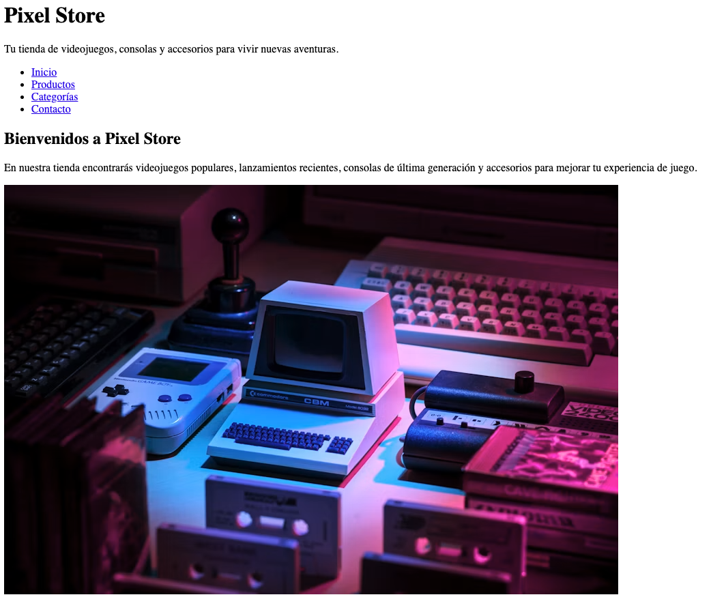
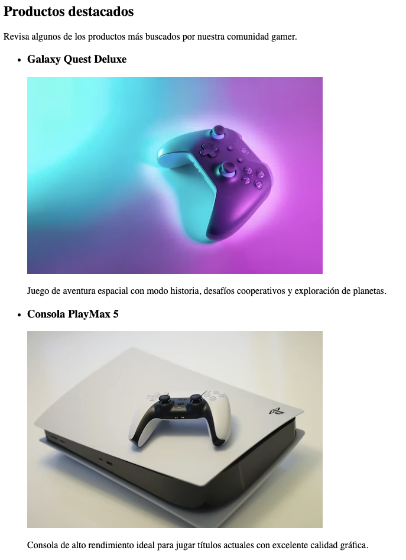
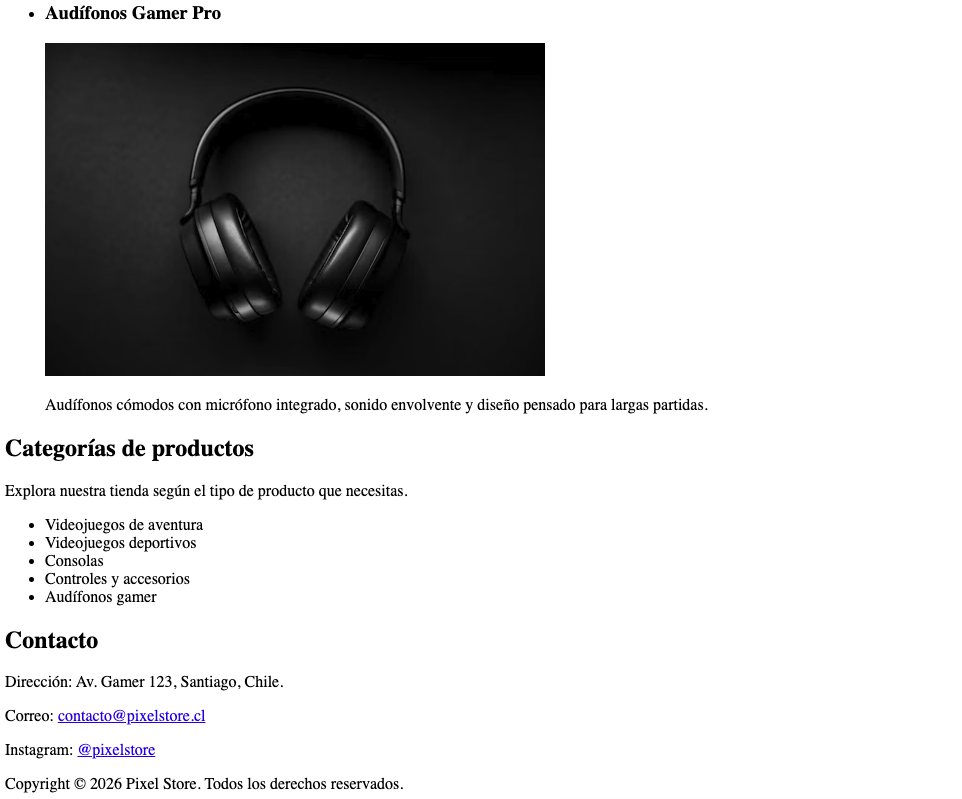
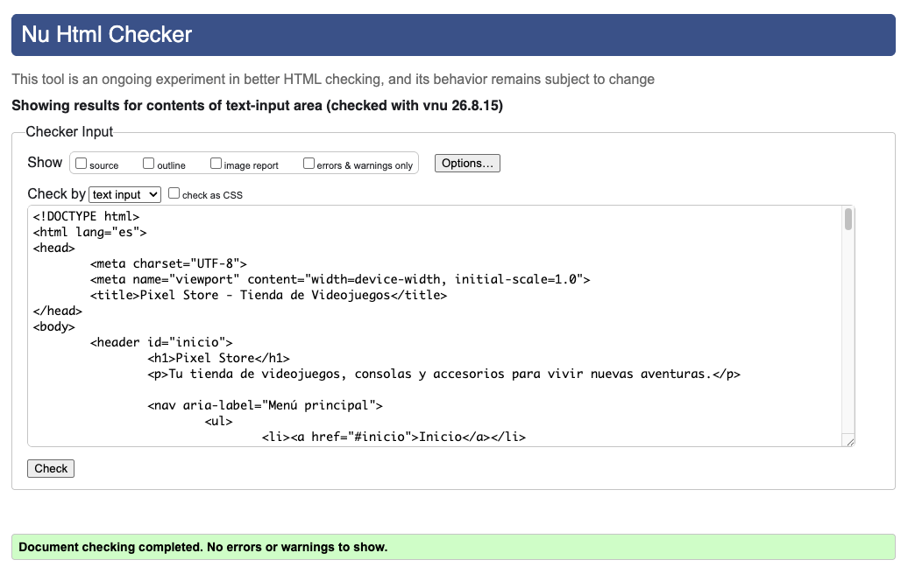

# Pixel Store - Tienda de Videojuegos

Página web básica creada en HTML para simular la página principal de una tienda de videojuegos.

## Descripción

El sitio presenta una estructura semántica usando etiquetas como `header`, `nav`, `main`, `section`, `article` y `footer`.

Incluye:

- Encabezados con `h1`, `h2` y `h3`.
- Párrafos descriptivos.
- Listas para navegación, productos y categorías.
- Enlaces internos y externos.
- Imágenes con texto alternativo.

## Archivo principal

El archivo principal del proyecto es:

```text
tienda-videojuegos.html
```

## Capturas

### Captura 1



### Captura 2



### Captura 3



### Captura 4

