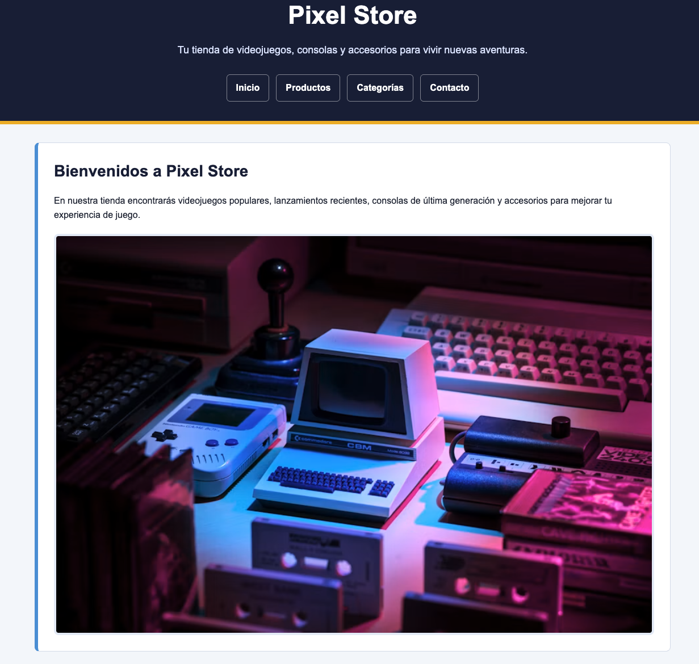
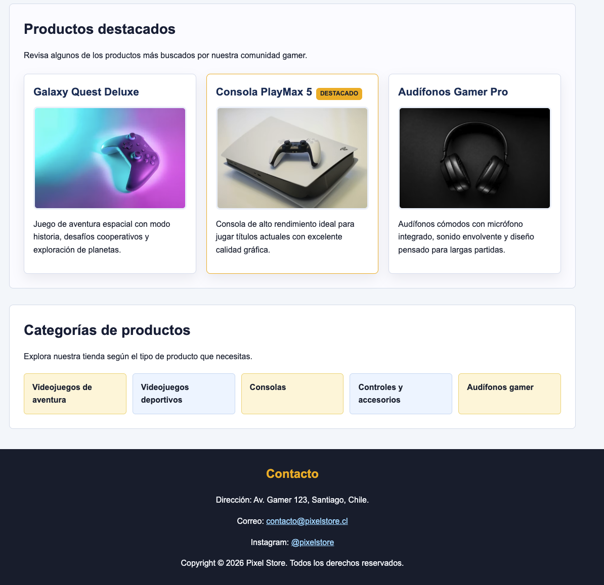
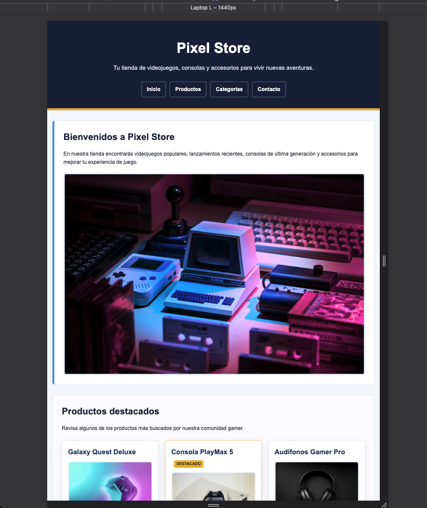
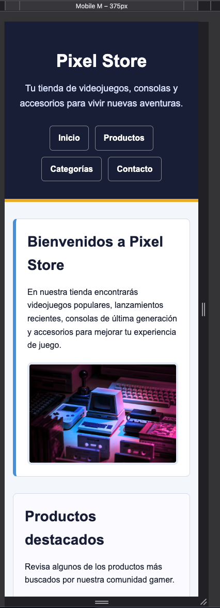
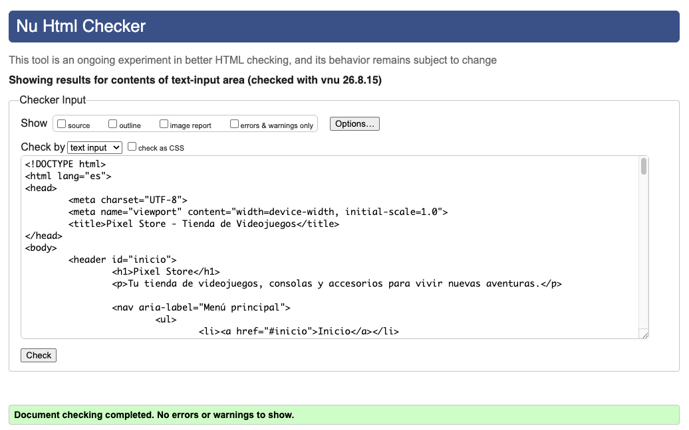
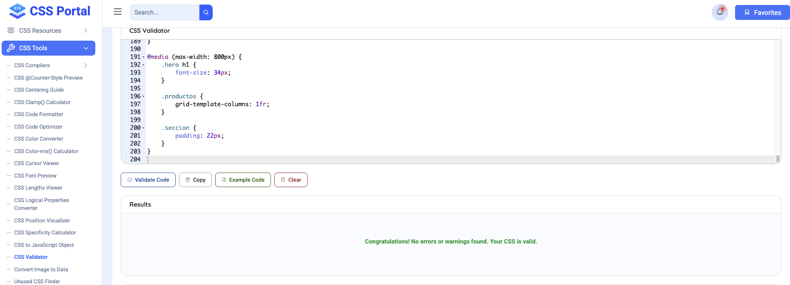

# Pixel Store - Tienda de Videojuegos

Página web de una tienda de videojuegos optimizada con CSS externo para la Semana 2 de Desarrollo Frontend I.

## Descripción

El sitio presenta una estructura semántica usando etiquetas como `header`, `nav`, `main`, `section`, `article` y `footer`, más una hoja de estilos externa para mejorar su presentación visual.

Incluye:

- Encabezados con `h1`, `h2` y `h3`.
- Párrafos descriptivos.
- Listas para navegación, productos y categorías.
- Enlaces internos y externos.
- Imágenes con texto alternativo.
- Modelo de cajas con `box-sizing`, `padding`, `margin` y `border`.
- Colores de fondo, texto, bordes y tipografías.
- Selectores de clase, ID y `nth-child()`.
- Diseño adaptable para pantallas pequeñas.

## Archivo principal

Los archivos principales del proyecto son:

```text
index.html
tienda-videojuegos.html
css/styles.css
```

## Capturas

### Vista inicial



### Productos destacados



### Vista responsive en laptop



### Vista responsive en mobile



### Validación HTML



### Validación CSS


