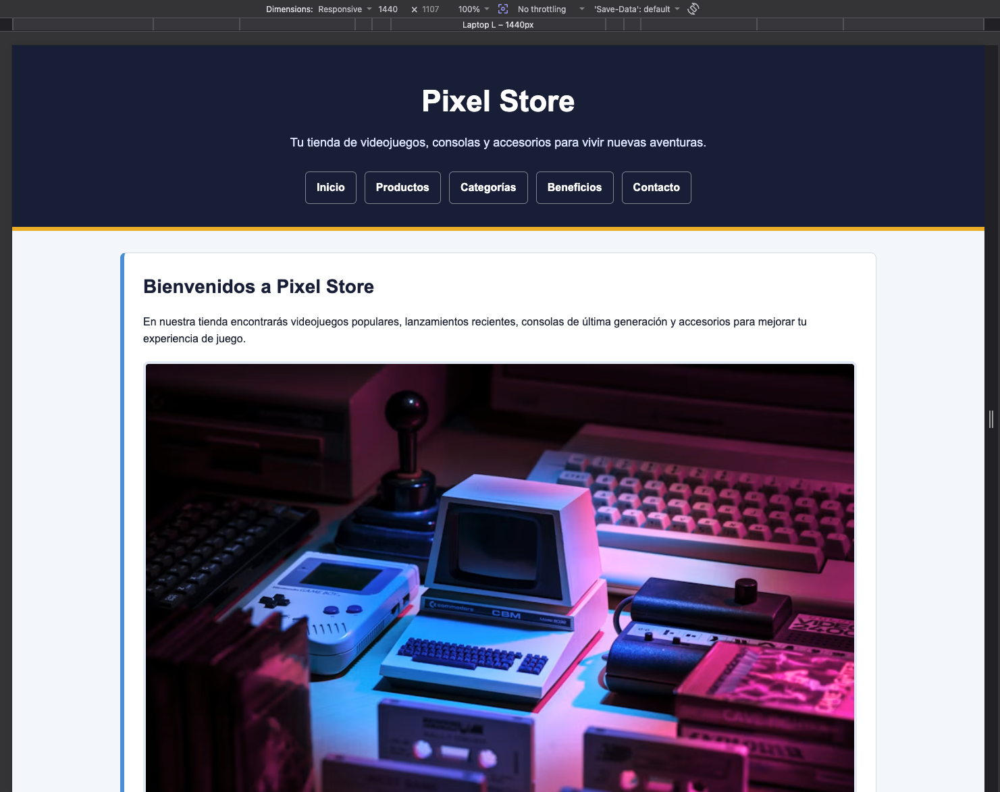
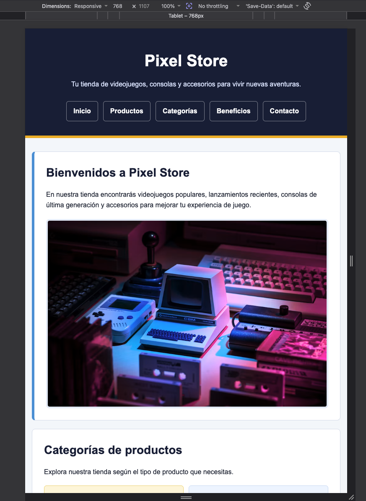
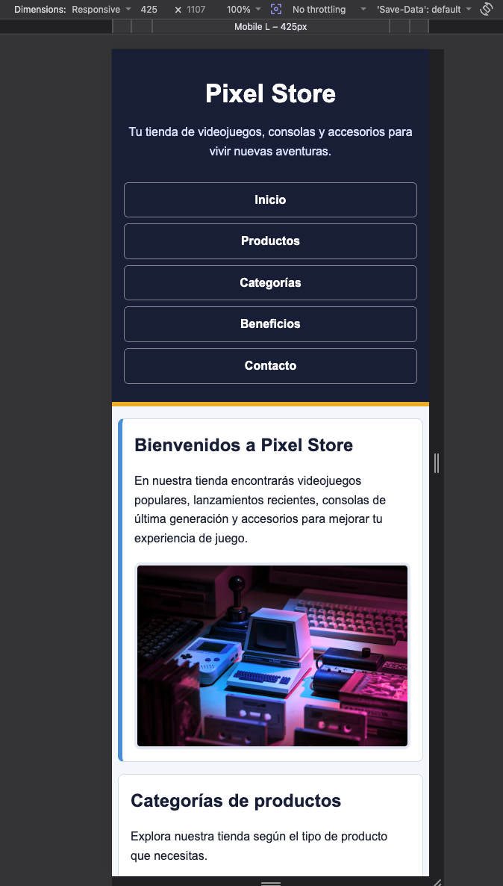

# Pixel Store - Tienda de Videojuegos

Sitio web de ecommerce para una tienda de videojuegos, optimizado como actividad sumativa de la Semana 3 de Desarrollo Frontend I.

## Descripción

El proyecto presenta una tienda online llamada Pixel Store. El sitio fue construido con HTML semántico y una hoja de estilos CSS externa, aplicando modelo de cajas, colores, tipografía, selectores CSS, Flexbox, CSS Grid y media queries para lograr una presentación responsiva en escritorio, tablet y móvil.

La página incluye un encabezado principal, navegación interna, una sección de bienvenida, categorías de productos, beneficios de compra, un catálogo de productos destacados y un pie de página con información de contacto.

## Características implementadas

- Estructura HTML semántica con `header`, `nav`, `main`, `section`, `article` y `footer`.
- Hoja de estilos externa vinculada desde `css/styles.css`.
- Modelo de cajas aplicado con `box-sizing`, `margin`, `padding`, `border` y `border-radius`.
- Paleta de colores y tipografía definidas mediante variables CSS.
- Catálogo ecommerce con 8 productos, precios, etiquetas, estados y botones de acción.
- Uso de Flexbox para navegación y organización interna de tarjetas.
- Uso de CSS Grid para layout principal, categorías, beneficios y grilla de productos.
- Media queries para adaptar la visualización en escritorio, tablet y móvil.
- Selectores de clase, ID, `:hover`, `:focus` y `nth-child()`.
- Imágenes con texto alternativo para mejorar la accesibilidad.

## Archivos principales

```text
index.html
css/styles.css
screenshots/
```

## Capturas de pantalla

### Vista escritorio



### Vista tablet



### Vista móvil



